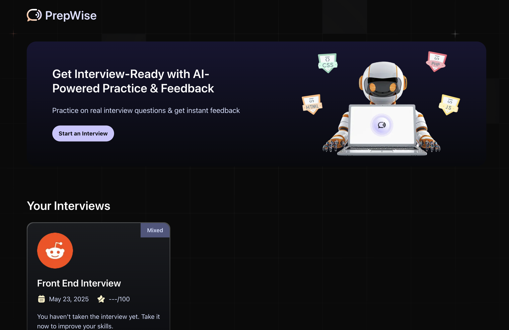
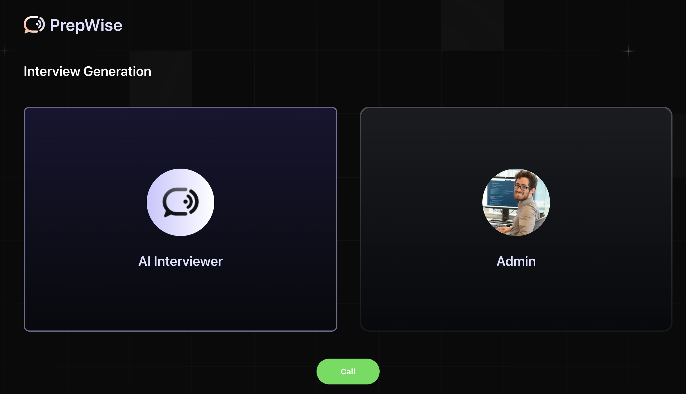

# インタビュープラットフォームのデモサイト

***
JavaScript MasteryというYouTubeチャンネルの[AI音声面接プラットフォーム作成動画](https://youtu.be/8GK8R77Bd7g?si=xNlHZAY8_9nU_n7i)を見ながら作成しました。AIを用いて面接対策をするもので、GeminiとVapi（音声AIエージェント）を用いて、インタビュー内容・レベル・質問の数を設定・作成、インタビュー実施、フィードバックの作成ができるサービスです。作成した面接内容やフィードバックはFirebaseに保存してあります。

## デモページ

https://interview-platform-mock.vercel.app/

### デモ用認証情報
メールアドレス：testuser@gml.com
 
パスワード：testuser

※ 「Start an Interview」ボタン押下 → 「Call」ボタン押下 → AI音声アシスタントと会話 → インタビューを作成完了

## 機能一覧
- 認証（/sign-in, /sign-up）
  - ログイン
  - ログアウト
  - 新規登録
- インタビュー作成ページ（/interview）
  - vapiを用いたインタビュー内容構築機能
- インタビューページ（/interview/[id]）
  - AIとのインタビュー練習機能
  - 評価作成機能（音声対話を切ると生成される）
- 振り返りページ（/interview/[id]/feedback）
  - 評価表示

## パッケージ
### フレームワーク・ライブラリ
  

### スタイリング・UI

### フォーム・バリデーション
  

### 日付操作・ユーティリティ
  
  
  

### AI・外部サービス
  
  
  
  
